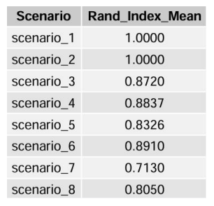

# CDBMM Causal Simulation

This repository contains the simulation study developed for my master's thesis to evaluate the Confounder-Dependent Bayesian Mixture Model (CDBMM).

The study examines whether CDBMM can accurately estimate heterogeneous treatment effects and recover latent subgroup structures under controlled simulation settings.

  

**Figure 1.** Data-generating structure connecting covariates, exposure, treatment assignment, latent groups, and potential outcomes.

## Simulation Workflow

1. Generate synthetic observational data.
2. Introduce structured covariate, exposure, and outcome dependencies.
3. Estimate individual and average treatment effects using CDBMM.
4. Recover latent subgroups and group average treatment effects.
5. Compare ATE estimation with BART and subgroup recovery with a BART-CART workflow.
6. Evaluate performance using Bias, MSE, Relative Error Ratio, and ARI.

## Simulation Design

Each simulation scenario includes:

- **500 observations**
- **Five covariates**: three continuous and two binary variables
- **Three latent subgroups**
- **Potential outcomes** under treatment and control
- **100 replications**
- **3,000 MCMC iterations**, including 2,000 burn-in iterations

Treatment and exposure are generated from a shared random source to introduce dependence between them. The latent groups are constructed from mixed covariates using Gower distance and Partitioning Around Medoids (PAM).

Group-specific potential outcomes and dependence structures are then imposed to represent heterogeneous treatment responses.

## Simulation Scenarios

Eight scenarios were designed by varying:

- Balanced versus unbalanced treatment assignment
- Homogeneous, weakly heterogeneous, and clearly heterogeneous effects
- Positive versus negative treatment effects

  

**Figure 2.** Treatment assignment, group average treatment effects, and purpose of the eight simulation scenarios.

## Evaluation Metrics

Model performance was evaluated using:

- **Bias** – systematic error in ATE estimation
- **Mean Squared Error (MSE)** – estimation error and variability
- **Relative Error Ratio** – MSE relative to the scale of the true ATE
- **Adjusted Rand Index (ARI)** – agreement between the true and inferred subgroup structures

## Main Results

CDBMM produced low overall bias and MSE across the eight scenarios. Estimation variability increased under clearly heterogeneous treatment effects, particularly when treatment assignment was unbalanced.

The Relative Error Ratio remained below 0.05 across all scenarios. CDBMM also recovered the underlying subgroup structures well and correctly identified the homogeneous control scenarios without creating artificial subgroups.

  

**Figure 3.** Distribution of ATE mean squared errors across the eight simulation scenarios.

  

**Figure 4.** Subgroup-recovery performance measured using the Adjusted Rand Index.

## Model Comparison

BART provided faster and more stable ATE estimation, with smaller MSE variability in several scenarios. CDBMM required greater computational effort but additionally identified latent subgroups and estimated group-specific treatment effects.

BCF code is included as an additional benchmark, although complete BCF results were not reported because of its substantially longer runtime.
